# Milestone 1
## Deskripsi Pendek
Milestone 1 menugaskan untuk mendesain sistem operasi dalam C (dan sedikit assembly untuk fitur tambahan)
dan memperkenalkan cara kerja sederhana interrupt. Target sistem operasi yang didesain adalah sistem 16-bit
yang akan diemulasikan pada emulator `bochs`.

Pengerjaan milestone 1 secara umum sudah dijelaskan pada spesifikasi milestone 1 sendiri, namun pada markdown
ini akan ditulis step-by-step pengerjaan dan penjelasan tentang hal terkait.

## Pengerjaan
### 1. Persiapan instalasi alat-alat yang digunakan
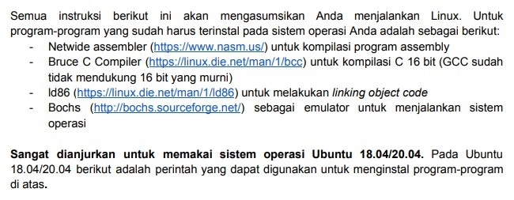

Sebelum melakukan langkah pengerjaan 3.1, diperlukan untuk memasang alat-alat yang digunakan untuk
membuat sistem operasi. Spesifikasi milestone 1 menganjurkan pemrogram untuk menggunakan sistem operasi
**Ubuntu versi 18.04 atau 20.04**, jika sudah menggunakan **ubuntu** dapat melanjutkan
pengerjaan ke bagian [instalasi alat-alat yang dibutuhkan](#2-pemasangan-alat-alat).

---

Penulis menggunakan [WSL2](https://docs.microsoft.com/en-us/windows/wsl/about) dalam host OS Windows 10
dalam pengerjaan tugas ini, troubleshooting masalah instalasi dan cara instalasi WSL2 dapat dilihat pada markdown
[WSL-OS-Troubleshooting.md](other/WSL-OS-Troubleshooting.md).

Untuk pengguna selain distribusi linux dan tidak ingin memasang sistem operasi baru pada mesin yang dimiliki
dapat menggunakan [virtual machine](https://en.wikipedia.org/wiki/Virtual_machine) seperti
[Oracle VirtualBox](https://www.virtualbox.org/) atau [VMWare](https://www.vmware.com/).
Instruksi untuk memasang virtual machine sudah cukup banyak dan mudah diakses dengan mencari
`Cara install virtualbox dan ubuntu` pada search engine.

---
### 2. Pemasangan alat-alat
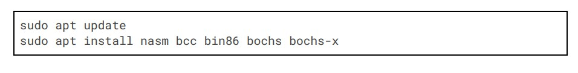

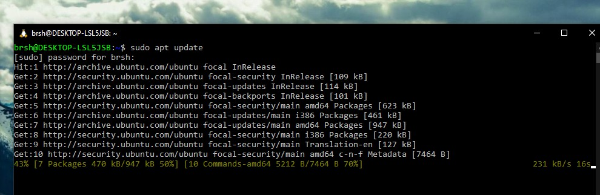

Jalankan command diatas pada terminal, jika menggunakan distribusi non-Ubuntu yang tidak menggunakan
package manager `apt`, gunakanlah package manager yang sesuai (contoh `apk` untuk Alpine).
Instalasi alat-alat dapat dimasukkan kedalam script jika ingin mempermudah pengguna lain,
cek pembuatan script pada section [tambahan script tools](#tambahan)

Setelah alat telah didownload dan install, buka dan unzip
[kit-1.zip](original-milestone/other) pada suatu lokasi.

---

Buatlah folder baru bernama `src` yang dalamnya berisi folder `asm` dan `bochs-config`.
Ketiga file `.asm` (`bootloader.asm`, `kernel.asm`, `lib.asm`) diletakkan pada folder `asm` dan
`if2230.config` pada folder `bochs-config`.

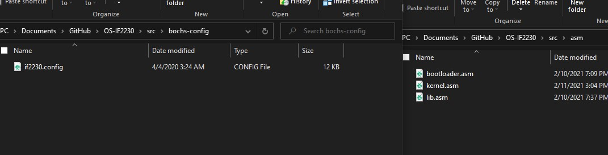

---
### 3. Persiapan disk image
Setelah memindahkan file ke folder yang terkait, buatlah folder `out` dan file baru tak berekstensi bernama `makefile`.
Bukalah file tersebut menggunakan text editor dan tambahkan recipe baru `all`, `clean`, dan `createbaseimage`. Tambahkan
juga text file baru bernama `.gitignore` pada lokasi sekarang yang berisi tulisan `out/*` untuk mengabaikan isi
dari folder `out` pada version control `git`.

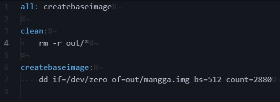

`makefile` akan digunakan sebagai alat utama untuk build/membuat sistem operasi.
Nantinya dapat menggunakan perintah `make <recipe>` untuk membuat resep. Resep
`all` digunakan untuk membuat sistem operasi sepenuhnya, resep `clean` digunakan
untuk menghapus hasil output pada folder `out`, sedangkan `createbaseimage` digunakan
untuk membuat disk image.

---

`dd` adalah command line utility pada distribusi Linux yang digunakan untuk melakukan operasi terhadap suatu *disc image*.

Argumen `if=/dev/zero` menyuruh `dd` untuk mengambil informasi pada `/dev/zero` sebagai source *image*, `/dev/zero` sendiri
merupakan file khusus pada distribusi Linux yang akan selalu menghasilkan nilai 0 jika dibaca. `if` kependekan dari `input file`.

Argumen `of=out/mangga.img` memberi tahu `dd` untuk meletakkan output ke `out/mangga.img`. Penulis menggunakan nama
disc image sistem operasi `mangga.img`, dapat diganti menjadi nama yang lain jika mau. `of` kependekan dari `output file`.

Argumen `bs=512` dan `count=2880` memberi informasi kepada `dd` berapa besar ukuran 1 sektor (`bs=512`) dan berapa banyak
sektor yang ada pada disc image (`count=2880`).

Singkatnya `if=/dev/zero` menyuruh `dd` untuk menulis nilai hex `0x00` sebanyak `bs=512` kali pada satu sektor dan terdapat
`count=2880` sektor ke file output yang bernama `of=out/mangga.img`.

---

Jalankan command `make createbaseimage` dan cek pada folder out.

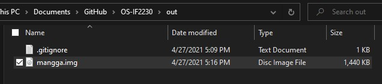

---
### 4. Bootloader
Tambahkan kode pada spesifikasi ke `makefile` dengan recipe bernama `insertbootloader`.

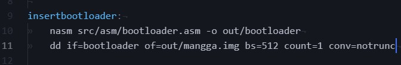

Perintah `nasm` seperti compiling pada umumnya, menerima source file (dalam kasus ini `src/asm/bootloader.asm`) dan
mengoutputkan ke `out/bootloader` dengan flag `-o`.

`dd` digunakan untuk memasukan binary executable hasil kompilasi `nasm` ke `out/mangga.img` yang memiliki ukuran 1 sektor
`bs=512` bytes dan diulangi sebanyak `count=1`. Flag `conv=notrunc` menyuruh `dd` untuk tidak merubah apapun pada sektor
selain sektor target `if=out/bootloader` yaitu sektor 0.

Jalankan `make insertbootloader` dan hasilnya akan terlihat seperti berikut pada hex editor

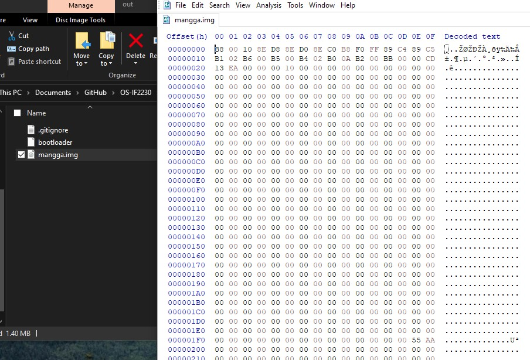

---

Pada tahap ini disarankan untuk mengecek [tambahan hex editor](#2-hex-editor) yang dapat digunakan mengecek hasil
build sistem operasi. Nantinya hex editor akan digunakan lagi secara ekstensif pada debugging dan pembuatan milestone 2
 filesystem.

---

### 5. Pembuatan kernel
**TBA**

## Tambahan
### 1. Script instalasi alat-alat
Untuk mempermudah pengguna lain dalam setup menjalankan sistem operasi yang dibuat,
dependencies installation dapat dimasukkan kedalam `bash` script sederhana.

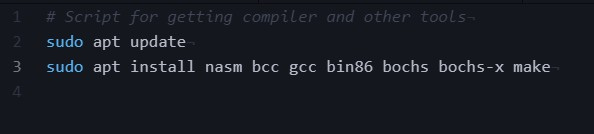

Tulislah kode tersebut pada file baru yang berekstensi `.sh`. Jika tidak menginginkan
menulis secara manual, gunakanlah pipe redirection seperti berikut

`printf "sudo apt update\nsudo apt install nasm bcc gcc bin86 bochs bochs-x make\n" > tools-install.sh`

Perintah tersebut akan menuliskan command untuk memasang dependencies dan mengarahkan output ke file baru
bernama `tools-install.sh`. Catatan, `bash` script umumnya perlu diberikan `chmod +x <filename>` terlebih dahulu
agar dapat dieksekusi seperti normal. Contoh eksekusi `bash` script `./tools-install.sh` jika sedang berada pada
lokasi direktori yang sama.

### 2. Hex editor
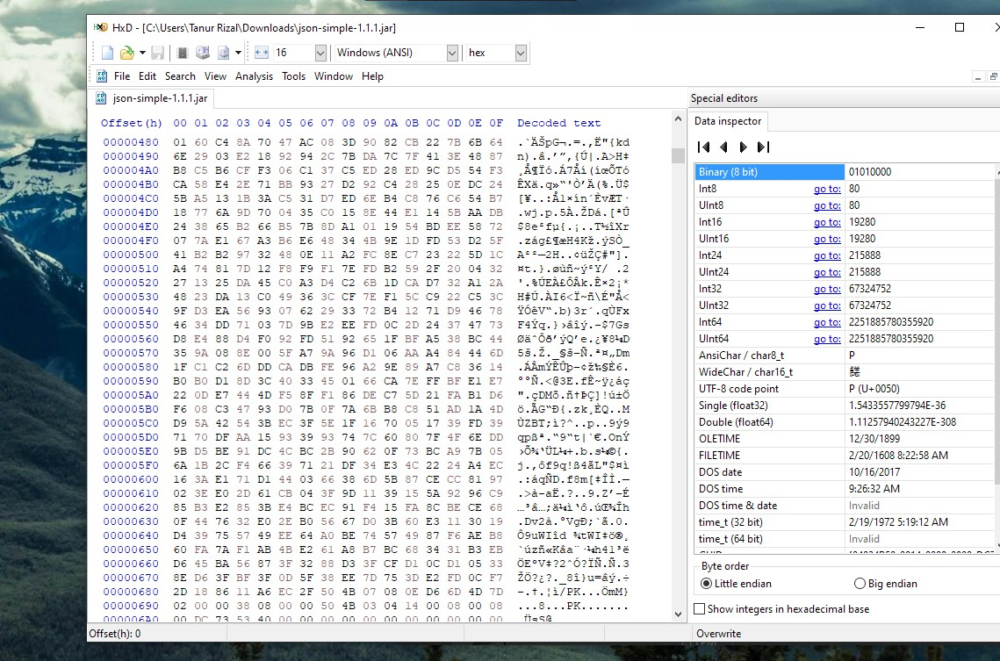

**HxD hex editor**

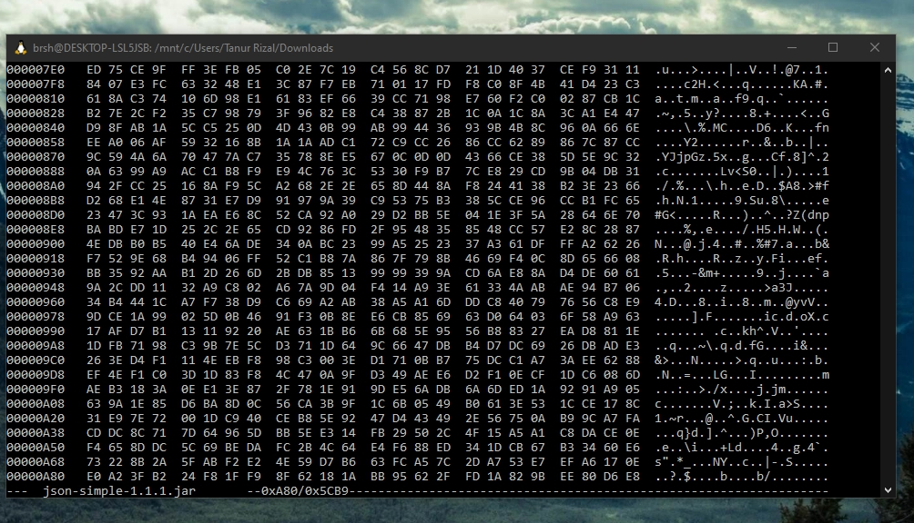

**hexedit hex editor**

Terdapat banyak hex editor yang dapat digunakan untuk mengedit dan membaca file binary secara hexadecimal. Kedua hex editor
diatas merupakan hex editor umum yang ada pada Windows dan Linux distribution. Hex editor nanti akan digunakan pada
milestone 2 pembuatan filesystem yang memerlukan pengecekan apakah disk I/O yang dioperasikan telah memenuhi keinginan atau
belum.

HxD hex editor dapat didownload pada link berikut [https://mh-nexus.de/en/hxd/](https://mh-nexus.de/en/hxd/).
HxD tersedia pada Windows 64-bit dan 32-bit.

`hexedit` merupakan command line utility yang umumnya dapat secara langsung didownload menggunakan package manager
masing-masing distro, contoh untuk instalasi `hexedit` pada Ubuntu `sudo apt-get install hexedit`.

<!--
Add later
https://wiki.osdev.org/Real_Mode#Information
-->
