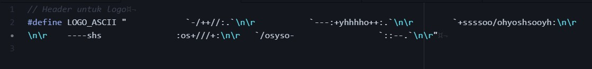
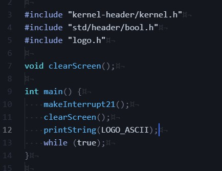
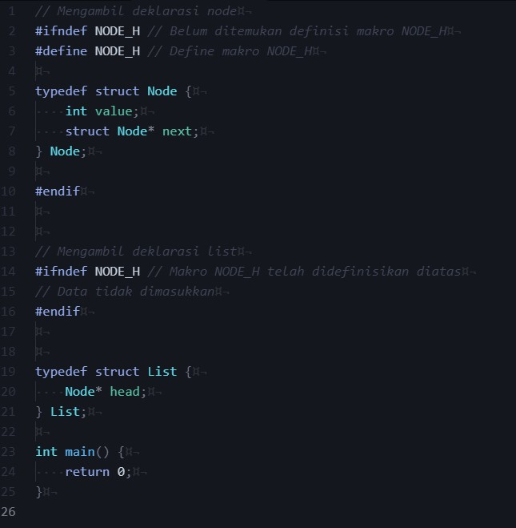

# Milestone 1
## Deskripsi Pendek
Milestone 1 menugaskan untuk mendesain sistem operasi dalam C (dan sedikit assembly untuk fitur tambahan)
dan memperkenalkan cara kerja sederhana interrupt. Target sistem operasi yang didesain adalah sistem 16-bit
yang akan diemulasikan pada emulator `bochs`.

Pengerjaan milestone 1 secara umum sudah dijelaskan pada spesifikasi milestone 1 sendiri, namun pada markdown
ini akan ditulis step-by-step pengerjaan dan penjelasan tentang hal terkait.

<!-- TODO : Self note : Check #personal for additional manim listing milestone 1 -->

### Daftar isi
#### Pengerjaan
| No | Isi                                                                          |
| -- | ---------------------------------------------------------------------------  |
| 1  | [Persiapan instalasi alat](#1-persiapan-instalasi-alat-alat-yang-digunakan)  |
| 2  | [Pemasangan alat](#2-pemasangan-alat-alat)                                   |
| 3  | [Persiapan disk image](#3-persiapan-disk-image)                              |
| 4  | [Pembuatan bootloader](#4-bootloader)                                        |
| 5  | [Pembuatan kernel.c](#5-pembuatan-kernel)                                    |
| 6  | [Menjalankan sistem operasi](#6-menjalankan-sistem-operasi)                  |
| 7  | [Pembuatan print dan read string](#7-pembuatan-printstring-dan-readstring)   |
| 8  | [Pembersihan kode](#8-pemisahan-source-code-dan-pembersihan)                 |

 

#### Pengerjaan bonus
| No | Isi                                        |
| -- | -----------------------------------------  |
| 1  | [Logo dalam ASCII](#1-logo-dalam-ascii)    |
| 2  | [Logo dalam grafis](#2-logo-dalam-grafis)  |

 

#### Tambahan
| No | Isi                                                        |
| -- | ---------------------------------------------------------  |
| 1  | [Script pemasangan alat](#1-script-instalasi-alat-alat)    |
| 2  | [Hex editor](#2-hex-editor)                                |
| 3  | [Penjelasan kernel.asm](#3-penjelasan-assembly-kernelasm)  |

 

#### Fun fact
| No | Isi                                                        |
| -- | --------------------------------------------------------   |
| 1  | [Real dan protected mode](#real-mode-dan-protected-mode)   |
| 2  | [DOS dan sistem operasi](#dos-dan-sistem-operasi)          |
| 3  | [Self modifying code](#self-modifying-code)                |

 
 
 
 
 

## Pengerjaan
### 1. Persiapan instalasi alat-alat yang digunakan

Sebelum melakukan langkah pengerjaan 3.1, diperlukan untuk memasang alat-alat yang digunakan untuk
membuat sistem operasi. Spesifikasi milestone 1 menganjurkan pemrogram untuk menggunakan sistem operasi
**Ubuntu versi 18.04 atau 20.04**, jika sudah menggunakan **ubuntu** dapat melanjutkan
pengerjaan ke bagian [instalasi alat-alat yang dibutuhkan](#2-pemasangan-alat-alat).

---

Penulis menggunakan [WSL2](https://docs.microsoft.com/en-us/windows/wsl/about) dalam host OS Windows 10
dalam pengerjaan tugas ini, troubleshooting masalah instalasi dan cara instalasi WSL2 dapat dilihat pada markdown
[WSL-OS-Troubleshooting.md](other/WSL-OS-Troubleshooting.md).

Untuk pengguna selain distribusi linux dan tidak ingin memasang sistem operasi baru pada mesin yang dimiliki
dapat menggunakan [virtual machine](https://en.wikipedia.org/wiki/Virtual_machine) seperti
[Oracle VirtualBox](https://www.virtualbox.org/) atau [VMWare](https://www.vmware.com/).
Instruksi untuk memasang virtual machine sudah cukup banyak dan mudah diakses dengan mencari
`Cara install virtualbox dan ubuntu` pada search engine seperti [google](https://www.google.com/).

 
 

### 2. Pemasangan alat-alat

Jalankan command diatas pada terminal, jika menggunakan distribusi non-Ubuntu yang tidak menggunakan
package manager `apt`, gunakanlah package manager yang sesuai (contoh `apk` untuk Alpine).
Instalasi alat-alat dapat dimasukkan kedalam script jika ingin mempermudah pengguna lain,
cek pembuatan script pada section [tambahan script tools](#tambahan-1)

Setelah alat telah didownload dan install, buka dan unzip
[kit-1.zip](original-milestone/other) pada suatu lokasi.

---

Buatlah folder baru bernama `src` yang dalamnya berisi folder `asm` dan `bochs-config`.
Ketiga file `.asm` (`bootloader.asm`, `kernel.asm`, `lib.asm`) diletakkan pada folder `asm` dan
`if2230.config` pada folder `bochs-config`.

 
 

### 3. Persiapan disk image
Setelah memindahkan file ke folder yang terkait, buatlah folder `out` dan file baru tak berekstensi bernama `makefile`.
Bukalah file tersebut menggunakan text editor dan tambahkan recipe baru `all`, `clean`, dan `createbaseimage`. Tambahkan
juga text file baru bernama `.gitignore` pada lokasi sekarang yang berisi tulisan `out/*` untuk mengabaikan isi
dari folder `out` pada version control `git`.

`makefile` akan digunakan sebagai alat utama untuk build/membuat sistem operasi.
Nantinya dapat menggunakan perintah `make <recipe>` untuk membuat resep. Resep
`all` digunakan untuk membuat sistem operasi sepenuhnya, resep `clean` digunakan
untuk menghapus hasil output pada folder `out`, sedangkan `createbaseimage` digunakan
untuk membuat disk image.

---

`dd` adalah command line utility pada distribusi Linux yang digunakan untuk melakukan operasi terhadap suatu *disc image*.

Argumen `if=/dev/zero` menyuruh `dd` untuk mengambil informasi pada `/dev/zero` sebagai source *image*, `/dev/zero` sendiri
merupakan file khusus pada distribusi Linux yang akan selalu menghasilkan nilai 0 jika dibaca. `if` kependekan dari `input file`.

Argumen `of=out/mangga.img` memberi tahu `dd` untuk meletakkan output ke `out/mangga.img`. Penulis menggunakan nama
disc image sistem operasi `mangga.img`, dapat diganti menjadi nama yang lain jika mau. `of` kependekan dari `output file`.

Argumen `bs=512` dan `count=2880` memberi informasi kepada `dd` berapa besar ukuran 1 sektor (`bs=512`) dan berapa banyak
sektor yang ada pada disc image (`count=2880`).

Singkatnya `if=/dev/zero` menyuruh `dd` untuk menulis nilai hex `0x00` sebanyak `bs=512` kali pada satu sektor dan terdapat
`count=2880` sektor ke file output yang bernama `of=out/mangga.img`.

---

Jalankan command `make createbaseimage` dan cek pada folder out.

 
 

### 4. Bootloader
Tambahkan kode pada spesifikasi ke `makefile` dengan recipe bernama `insertbootloader`.

Perintah `nasm` seperti compiling pada umumnya, menerima source file (dalam kasus ini `src/asm/bootloader.asm`) dan
mengoutputkan ke `out/bootloader` dengan flag `-o`.

`dd` digunakan untuk memasukan binary executable hasil kompilasi `nasm` ke `out/mangga.img` yang memiliki ukuran 1 sektor
`bs=512` bytes dan diulangi sebanyak `count=1`. Flag `conv=notrunc` menyuruh `dd` untuk tidak merubah apapun pada sektor
selain sektor target `if=out/bootloader` yaitu sektor 0.

Jalankan `make insertbootloader` dan hasilnya akan terlihat seperti berikut pada hex editor

---

Pada tahap ini disarankan untuk mengecek [tambahan hex editor](#2-hex-editor) yang dapat digunakan mengecek hasil
build sistem operasi. Nantinya hex editor akan digunakan lagi secara ekstensif pada debugging dan pembuatan milestone 2
 filesystem.

 
 

### 5. Pembuatan kernel
Secara singkat bagian ini dapat mengikuti secara langsung spesifikasi pembuatan kernel dengan membuat file baru `kernel.c`
pada folder `src`. Isilah `kernel.c` dengan kode yang terdapat pada spesifikasi milestone 1 dan sedikit modifikasi untuk
mengikuti cara koding C pada umumnya.

Keyword `extern` digunakan untuk memberi tahu kepada `bcc` atau compiler lain untuk menganggap fungsi tersebut
akan disediakan pada file source code yang lain. Atau dapat dikatakan `extern` memperbolehkan pemrogram mendeklarasikan
fungsi yang tidak diberikan definisi pada file tersebut.

Setelah membuat file tersebut tambahkan kode berikut pada `makefile`

Line `if [ ! -d "out/obj" ]; then mkdir out/obj; if` mengecek apakah ada folder `obj` pada folder `out`, jika tidak ada
maka buat folder tersebut dengan `mkdir out/obj`.

Seperti sebelumnya `bcc` dan `nasm` mencompile source code menjadi object file dengan flag yang sesuai. Flag `-ansi` dan
`-f as86` memberikan informasi terkait cara kompilasi `bcc` dan `nasm`.

`ld86` digunakan untuk melink semua object file dan mengeluarkan dengan nama `out/kernel`.
Flag `-d` sangat penting ketika proses linking, cek pada
[catatan README.md](README.md#catatan-penting-ketika-melakukan-pengerjaan).

Parameter tambahan `seek=1` pada `dd` digunakan untuk memasukkan input file ke sektor 1.

---

Jalankan `make insertbasekernel` dan pada hex editor akan terlihat pada `mangga.img`

 
 

### 6. Menjalankan sistem operasi
Setelah memastikan tahap sebelumnya telah berjalan dengan normal, sekarang sistem operasi dapat diuji dengan dijalankan.
Buatlah file baru bernama `run.sh` yang berisikan kode `bochs -f src/bochs-config/if2230.config`. Setelah file dibuat, buka
file `if2230.config` dengan text editor, carilah `floppya: 1_44=system.img`. Ganti konfigurasi tersebut ke nama disc image
yang dibuat (beserta relative pathing terhadap root). Contoh jika menggunakan `mangga.img` pada folder `out`, kode tersebut
menjadi `floppya: 1_44=out/mangga.img`.

---

Setelah itu kembali ke folder root dan jalankan `./run.sh` (Catatan kecil untuk WSL, jangan lupa menjalankan X server!).
Akan terlihat window baru bernama `Bochs x86-64 emulator` yang berisikan panel hitam.

Ketik `c` pada terminal dan tekan enter, jika kernel telah dimasukkan dengan normal akan keluar seperti berikut

Perhatikan pada pojok kiri atas terdapat tulisan `Hai` dalam warna magenta seperti yang tertulis pada `main()`.

 
 

### 7. Pembuatan printString dan readString
Jika sistem operasi sudah berhasil untuk menuliskan `Hai` dalam warna magenta pada tahap sebelumnya, maka fungsionalitas
lain seperti `printString` dan `readString` sudah dapat diimplementasikan pada `kernel.c`. Kode yang diberikan pada
spesifikasi dapat dipindahkan ke `kernel.c`.

---

Prosedur yang paling mudah diimplementasi terlebih dahulu adalah `void clear()`. Prosedur `clear()` berfungsi untuk
membersihkan **1 byte** array `buffer` sebanyak `length` bytes atau mengisi `buffer` dengan `0x00` sebanyak `length`.
Sederhananya dapat menggunakan loop `for` untuk mengisi buffer tersebut dengan `0x00`.

Loop tersebut akan mengisi dari awal array `buffer` hingga batas `length` tercapai. Setelah itu prosedur akan berhenti.

---

Prosedur selanjutnya yang akan diimplementasikan adalah `void printString()`. Prosedur `printString()` menuliskan isi
array `string` ke layar. Dapat digunakan loop `while` sederhana untuk menuliskan isi `string` hingga ditemukan `0x00` atau
**null terminator**.

Pada `interrupt(0x10, AX, 0x000F, 0, 0);` digunakan fitur yang disediakan pada BIOS yaitu
[INT 10h](https://en.wikipedia.org/wiki/INT_10H).

 

Berikut adalah potongan screenshot parameter `INT 10h` dari link diatas

 

`interrupt(0x10, AX, 0x000F, 0, 0);`

Argumen pertama adalah nomer interrupt yang akan dipanggil, dalam kasus ini adalah `0x10`.

Argumen kedua merupakan gabungan dari `AH` dan `AL`. Pada gambar diatas terlihat bahwa untuk mengakses **Teletype output**
diperlukan nilai `AH = 0Eh` atau dalam notasi lain `AH = 0x0E`. Bagian register `AL` membawa nilai karakter dalam **ASCII**.
Operator `|` adalah **bitwise or**, yang akan menggabungkan `AH` dan `AL` menjadi satu dalam `AX`.

Berikut gambaran operasi bitwise OR pada `AH` dan `AL` untuk menghasilkan `AX`

https://user-images.githubusercontent.com/30568743/116785698-1e62c200-aac5-11eb-9e1e-dd2d56102d12.mp4

 

Argumen ketiga `BX` terdiri dari `BH` sebagai **page number** dan `BL` sebagai **kode warna**. Page number digunakan untuk
melakukan [double buffering](https://en.wikipedia.org/wiki/Multiple_buffering) dan untuk kasus sederhana tidak terlalu
penting untuk digunakan, sehingga menggunakan page number default `0x00`. Kode warna yang digunakan merupakan
[BIOS color attributes](https://en.wikipedia.org/wiki/BIOS_color_attributes), kode `0x0F` merepresentasikan warna putih.

Argumen ke empat dan kelima seperti pada tabel `INT 10h`, tidak digunakan untuk operasi penulisan karakter
**Teletype output**.

 

Secara singkat kode tersebut akan mengulangi proses penulisan karakter dengan `interrupt()` hingga ditemukan karakter
null terminator. Bagian pengecekan karakter berada pada `while (string[i] != 0x00)`.

---

Prosedur terakhir yang diimplementasikan adalah `readString()`. Prosedur ini membaca input keyboard dan memasukkannya
kedalam array yang berada pada address `string`. Loop pembacaan `while` akan berhenti jika pengguna menekan tombol
 **enter**.

BIOS interrupt yang digunakan pada `readString()` adalah [INT 16h](https://en.wikipedia.org/wiki/INT_16H).

 

Berikut adalah potongan screenshot dari link

 

`singleCharBuffer = interrupt(0x16, 0x0000, 0, 0, 0);`

Perhatikan pada potongan kode diatas, hasil return dari `interrupt()` merupakan hasil pembacaan keyboard oleh `INT 16h`.
 Bagian [penjelasan kernel.asm](#3-penjelasan-assembly-kernelasm) telah menjelaskan bahwa fungsi `interrupt()` hanya akan
 mengembalikan nilai `AL` ke register `AX`. Pada potongan `INT 16h` diatas terlihat bahwa `INT 16h` dengan `AH = 0x00` akan
 menghasilkan 2 nilai yang ditaruh pada `AH` dan `AL`. Untuk kasus sederhana hasil return `AH` yaitu **scancode** dapat
 diabaikan, sehingga `readString()` hanya membutuhkan hasil return `AL` untuk membaca input keyboard pengguna. Fungsi
 `interrupt()` akan mengembalikan nilai **ASCII** karakter keyboard dan menaruhnya pada `singleCharBuffer`.

 

`if (singleCharBuffer != '\r')`

Pengecekan `singleCharBuffer != '\r'` digunakan untuk mengecek apakah input yang baru dibaca bukan tombol enter. Dalam
branch tersebut dilakukan penulisan karakter yang dibaca dengan `interrupt(0x10, AXprintChar, 0x000F, 0, 0);` setelah itu
memasukkan karakter kedalam `string`.

Branch `else` melakukan penggeseran keyboard kursor ke pojok kiri dan kebawah. Penggeseran kursor ke pojok kiri menggunakan
karakter `\r` atau **Carriage return** dan penggeseran kebawah menggunakan `\n` atau **Line feed**.

---

Setelah mengimplementasikan ketiga fungsi diatas, dapat ditambahkan kode berikut pada `main`

Loop `while` tersebut akan diulangi terus menerus ketika melakukan testing. `clear()` akan membersihkan `buffer` sebelum
digunakan sebagai tempat pembacaan input dengan `readString()`. Setelah dibaca `printString()` akan menuliskan hasil
pembacaan ke layar.

---

Tambahkan kode berikut pada `makefile` untuk melengkapi resep `all`

---

Lakukan `make insertbasekernel` dan jalankan `./run.sh`, jika tidak ada permasalahan maka sistem operasi dapat menerima
input dan menuliskan ke layar seperti screenshot berikut

 
 

### 8. Pemisahan source code dan pembersihan
Setelah implementasi `clear()`, `printString()`, dan `readString()` berhasil,
**spesifikasi wajib milestone 1 telah selesai**. Untuk spesifikasi nomor 6, cara kerja `interrupt()` dan cara kerja kode
 `kernel.asm` dapat dijelaskan sendiri dengan mengikuti arahan spesifikasi atau mengecek bagian
[tambahan penjelasan kernel.asm](#3-penjelasan-assembly-kernelasm). Bagian ini hanya membersihkan kode yang ada pada
`kernel.c`.

---

Buatlah folder baru bernama `kernel-header` terletak pada folder `src`, didalam folder tersebut buat file baru bernama
`kernel.h`.

---

Buka file `kernel.c` dan potong / cut bagian deklarasi. Setelah dipotong, hapus pengetesan yang dilakukan pada tahap
sebelumnya pada `main()` dan tambahkan `#include` seperti berikut

Catatan, jika mengalami permasalahan setelah melakukan pemindahan deklarasi, pastikan terdapat **newline** antara komentar
 dan `#include` seperti yang terdapat pada [catatan README.md](README.md#catatan-penting-ketika-melakukan-pengerjaan).

---

Buka file file `kernel.h` yang sebelumnya telah dibuat pada folder `kernel-header` dan paste deklarasi kode sebelumnya
pada file tersebut.

---

Buatlah sebuah folder baru pada `src` bernama `std`, didalam folder tersebut buatlah folder lagi bernama `header`.
Pada folder header buatlah sebuah file baru bernama `bool.h`. Header ini akan digunakan sebagai implementasi sederhana tipe
data boolean yang digunakan untuk memperjelas kode.

---

Isi file `bool.h` dengan kode berikut

Secara singkat implementasi boolean, `#define bool char` memberitahu kepada preprosesor untuk mengganti tulisan `bool`
pada source code menjadi `char`. `#define true 1` dan `#define false 0` juga melakukan hal yang sama kepada tulisan `true`
dan `false`. Untuk penjelasan `bool` dan penggunaan `#ifndef`, `#endif` lebih detail akan dijelaskan pada
[tambahan tentang include guard](#4-include-guard-dan-tipe-data-boolean).

---

Tambahkan direktif `#include "std/header/bool.h"` pada `kernel.c` dan ganti angka `1` pada kondisi loop ke `true`.

---

Setelah pemindahan diatas, tes lagi dengan `make insertbasekernel` dan jalankan `./run.sh`, jika berhasil maka sistem
operasi berhasil dijalankan oleh `bochs` dan tidak melakukan apapun setelah booting seperti gambar

 
 
 
 
 

## Pengerjaan bonus
### 1. Logo dalam ASCII
Pembuatan logo dalam ASCII cukup sederhana dengan menggunakan `printString()` dan konverter ASCII online. Namun sebelum
melakukan penggambaran logo dalam ASCII, penulisan booting `bochs` dapat dibersihkan terlebih dahulu menggunakan penggantian
 video mode.

Kode `interrupt(0x10, AX, 0, 0, 0);` dengan `AH` bernilai `0x00` mengganti video mode ke nilai `AL`. Interrupt pertama
mengganti video mode ke `0x10` dan interrupt kedua mengembalikan video mode kembali ke `0x03`. Penggantian video mode akan
mengosongkan video memory buffer atau kata lainnya menghapus seluruh gambar seperti yang diinginkan. Jika dijalankan kode
diatas akan menghasilkan seperti dibawah

---

Pindahkan kode pemanggilan `interrupt()` ke sebuah prosedur baru bernama `clearScreen()` seperti berikut

---

Tahap selanjutnya dapat menuliskan ASCII yang diinginkan menggunakan `printString()`, gunakanlah converter yang mudah
ditemukan dengan keyword `jpg to ASCII` atau lainnya pada search engine seperti [google](https://www.google.com/).

---

Setelah mengkonversi target gambar seperti diatas, pindahkan ke hasil konversi tersebut ke file baru bernama `logo.h`
pada folder `src`, lakukan copy paste ke file tersebut

---

Tambahkan `#define LOGO_ASCII "` diatas logo dan tambahkan juga `\n\r` pada setiap akhir baris seperti berikut

---

Lakukan penghapusan newline pada kode dengan tombol *backspace* atau *delete*

---

Hasil dari penghapusan diatas adalah `#define LOGO_ASCII "<logo>` yang panjang, tambahkan `"` pada akhir logo untuk menutup
quotation mark

---

Tambahkan `printString()` dan `#include "logo.h"` di `kernel.c` untuk melakukan pengujian

---

Jalankan sistem operasi, jika proses insersi logo ASCII berjalan dengan benar akan terlihat seperti berikut

 
 

### 2. Logo dalam grafis
**TBA**

 
 
 
 
 

## Tambahan
Berikut adalah beberapa informasi tambahan yang digunakan untuk menjelaskan detail-detail, fungsionalitas tambahan, dan
alat-alat yang dapat digunakan untuk membantu proses pembuatan sistem operasi.

---
### 1. Script instalasi alat-alat
Untuk mempermudah pengguna lain dalam setup menjalankan sistem operasi yang dibuat,
dependencies installation dapat dimasukkan kedalam `bash` script sederhana.

Tulislah kode tersebut pada file baru yang berekstensi `.sh`. Jika tidak menginginkan
menulis secara manual, gunakanlah pipe redirection seperti berikut

`printf "sudo apt update\nsudo apt install nasm bcc gcc bin86 bochs bochs-x make\n" > tools-install.sh`

Perintah tersebut akan menuliskan command untuk memasang dependencies dan mengarahkan output ke file baru
bernama `tools-install.sh`. Catatan, `bash` script umumnya perlu diberikan `chmod +x <filename>` terlebih dahulu
agar dapat dieksekusi seperti normal. Contoh eksekusi `bash` script `./tools-install.sh` jika sedang berada pada
lokasi direktori yang sama.

 
 

### 2. Hex editor

**HxD hex editor**

**hexedit hex editor**

Terdapat banyak hex editor yang dapat digunakan untuk mengedit dan membaca file binary secara hexadecimal. Kedua hex editor
diatas merupakan hex editor umum yang ada pada Windows dan Linux distribution. Hex editor nanti akan digunakan pada
milestone 2 pembuatan filesystem yang memerlukan pengecekan apakah disk I/O yang dioperasikan telah memenuhi keinginan atau
belum.

HxD hex editor dapat didownload pada link berikut [https://mh-nexus.de/en/hxd/](https://mh-nexus.de/en/hxd/).
HxD tersedia pada Windows 64-bit dan 32-bit.

`hexedit` merupakan command line utility yang umumnya dapat secara langsung didownload menggunakan package manager
masing-masing distro, contoh untuk instalasi `hexedit` pada Ubuntu `sudo apt-get install hexedit`.

 
 

### 3. Penjelasan assembly kernel.asm
Sebagian besar kode assembly sudah dijelaskan pada spesifikasi pembuatan kernel,
bagian ini hanya menjelaskan ulang dengan cara yang lain.

---

`void putInMemory (int segment, int address, char character)`

Fungsi tersebut menuliskan angka 1 byte yang bernama `character` kepada memori yang terletak pada `0x10*segment + address`.
Umumnya segment bernilai kelipatan dari `0x1000` hal ini dikarenakan biasanya segment hanya digunakan ketika ingin mengakses
memori diatas 16-bit address (`0x0000` hingga `0xFFFF`). Perhatikan bahwa nilai `segment` dikalikan `0x10` terlebih dahulu
sehingga dapat mengakses memori address `0x10000` hingga `0x1FFFF` jika nilai `segment` adalah `0x1000`
(Perkalian hexadecimal `0x10*0x1000` menghasilkan `0x10000`).

Pada sisi assembly, terdapat **segment register** untuk **setiap register data** yang ada. Secara implisit,
nilai yang terletak pada segment register akan dikalikan `0x10` ketika meng-fetch suatu data. Contoh register instruksi `ip`
 berhubungan dengan segment register `cs` yaitu data segment, secara implisit setiap kali CPU mengambil instruksi akan
mengambil pada address `0x10*cs + ip`. Misal nilai `cs` diset pada `0x1000` dan `ip` terletak pada `0xC400`, CPU akan
mengambil instruksi yang terletak pada `0x1000*0x10 + 0xC400` yaitu `0x1C400`, bukan instruksi pada `0xC400`. Segment
 register tidak dipergunakan lagi jika ingin memasuki **64-bit protected mode**. Segment register umumnya memiliki nama
 yang sama dengan **struktur segmentasi memori x86**, untuk lebih jelasnya cek
 [x86 memory segmentation](https://en.wikipedia.org/wiki/X86_memory_segmentation).

Implementasi `putInMemory` pada `.asm` secara singkat mengganti sementara segment register `ds` ke target `segment`
yang terletak pada `[bp+4]` dan memindahkan 1 byte integer `character` ke lokasi `address` pada instruksi `mov [si], cl`.

---

`int interrupt (int number, int AX, int BX, int CX, int DX)`

Seperti namanya, fungsi `interrupt()` akan melakukan suatu interrupt `number` yang diberikan argumen vektor `AX`, `BX`, `CX`
, dan `DX`. Contohnya pemanggilan `interrupt(0x10, 0x0C0E, 0x0, 256, 128);` akan melakukan interrupt `0x10` yang
menyediakan fasilitas I/O. Jika belum familiar dengan cara kerja hexadecimal dan 16-bit register, dapat mengecek
[appendix hexadecimal dan register](Appendix.md#4-hexadecimal-dan-register).
Contoh diatas akan dijelaskan lebih lanjut pada appendix hexadecimal dan register.

Interrupt merupakan fasilitas pada BIOS yang disediakan oleh komputer yang berdasarkan IBM PC. Fitur ini umumnya tidak
digunakan lagi pada **protected mode**, sistem operasi yang sedang dibuat merupakan sistem operasi yang bekerja pada
**real mode**. Interrupt dipergunakan untuk melakukan fasilitas-fasilitas input-output dasar pada hardware yang digunakan.

Instruksi interrupt akan membuat CPU untuk mengakses
[interrupt vector table](https://en.wikipedia.org/wiki/Interrupt_vector_table) yang berisikan address-address fungsi atau
prosedur yang akan dijalankan ketika interrupt dipanggil. Fungsi dan prosedur tersebut dinamakan **interrupt handler**.
BIOS menyediakan beberapa interrupt handler yang dapat digunakan pemrogram, interrupt yang tersedia dapat dicek pada halaman
 [BIOS interrupt call](https://en.wikipedia.org/wiki/BIOS_interrupt_call).

Sistem operasi yang dibuat mencoba untuk mengikuti fitur-fitur yang tersedia pada sistem operasi **DOS**, penjelasan
menarik terkait hal ini dapat dicek pada bagian [fun fact DOS](#dos-dan-sistem-operasi). Fitur yang biasanya ada pada
DOS adalah interrupt `0x21` yang memiliki banyak sekali fitur yang dapat digunakan pengguna sistem operasi.
Penjelasan lebih detail terkait interrupt `0x21` akan dijelaskan pada `void makeInterrupt21()` dan
`void handleInterrupt21()`.

Implementasi assembly `interrupt()` secara singkat merupakan wrapper dari instruksi `INT` dan memindahkan
parameter-parameter ke register yang bersangkutan. Instruksi `INT` meminta sebuah angka tetap sehingga diperlukan
**self-modifying code**, informasi tersebut dapat dicek pada bagian [fun fact](#self-modifying-code). Hasil interrupt
yang dikembalikan pada register `AX` akan dihapus `AH` agar hanya mengembalikan nilai `AL` pada instruksi `mov ah, 0`.

---

`void makeInterrupt21()` dan `void interrupt21ServiceRoutine()`

Prosedur ini memiliki tujuan untuk memasang address `interrupt21ServiceRoutine()` pada **interrupt vector table**
 dengan lokasi relatif `0x21` terhadap tabel. Interrupt vector table `0x21` akan diisi dengan address
 `interrupt21ServiceRoutine()` yang akan dipanggil ketika `INT 0x21` terjadi.

Implementasi `makeInterrupt()` secara singkat akan menyiapkan address `interrupt21ServiceRoutine()` dan memasukkan pada
interrupt vector table. `interrupt21ServiceRoutine()` akan mengambil register-register dan memasukkannya sebagai argumen
pemanggilan fungsi `handleInterrupt21()`.

 
 

### 4. Include guard dan tipe data boolean
#### Include guard
Pasangan direktif `#ifndef <name>`, `#define <name>` diawal file dan `#endif` diakhir file dinamai **include guard**.
Kegunaan dari include guard adalah mencegah terjadinya pendefinisian 2 kali ketika melakukan `#include`. Referensi tentang
include guard dapat dicek pada [wikipedia](https://en.wikipedia.org/wiki/Include_guard). Berikut adalah ilustrasi sederhana
 include guard

---

Misalkan ingin membuat suatu program yang menggunakan linked list dan ingin menggunakan node pada implementasinya, pemrogram
 akan memiliki file list dan node yang nantinya di `#include` didalam program seperti berikut

---

Implementasi `Node` dan `List` tidak menggunakan include guard seperti berikut

Perhatikan pada implementasi `List` terdapat direktif `#include "node.h"`.

---

Jika kode diatas dicompile menggunakan `gcc`, akan terlihat pesan seperti berikut

`gcc` mengeluarkan pesan error `node.h:3:16: error: redefinition of ‘struct Node’` yang memiliki arti terdapat definisi
struktur data yang bernama sama lebih dari sekali.

---

Hal diatas disebabkan preprosesor yang menemukan direktif `#include` akan memasukkan isi `list.h` dan `node.h` sepenuhnya
menghasilkan kode seperti berikut

Kode tersebut merupakan hasil preprosesor yang nantinya akan dibaca oleh compilation unit. Compilation unit menemukan
 definisi `typedef struct Node {} Node;` dua kali akan berhenti dan mengeluarkan pesan error seperti diatas.

---

Hal diatas dapat diatasi dengan menggunakan include guard pada `node.h`.

Direktif `#ifndef NODE_H` menginstruksikan preprosesor **hanya memasukkan kode** antara `#ifndef` dan `#endif` jika
 definisi makro `#define NODE_H` tidak pernah ditemukan. `#define NODE_H` setelah `#ifndef` memastikan kode dibawah telah
 dimasukkan pada suatu source code dengan `#include` sehingga jika dilakukan `#include` berulang akan menghasilkan
 text kosong.

---

Hasil include guard pada source code `main.c` seperti berikut

Definisi `typedef struct Node {} Node;` tidak lagi dilakukan lebih dari satu kali dikarenakan preprosesor telah mengganti
dan membuang definisi kedua kalinya. Program tersebut akan dicompile secara normal pada `gcc`.

 
 

#### Tipe data boolean pada C
Tipe data primitif pada bahasa C adalah `char`, `int`, `float`, dan `double`. Bahasa C asli tidak memiliki tipe data
boolean yang biasanya terdapat pada bahasa yang lebih tinggi seperti Python atau C++. Sehingga untuk mengecek kondisi pada
control flow seperti `if`, **seluruh** angka selain nol dianggap bernilai **benar** atau **true** dan angka nol dianggap
memiliki nilai **salah** atau **false**.

Pada bahasa C dan sebagian besar turunan dari C umumnya memperbolehkan casting secara implisit dari tipe data angka ke
evaluasi boolean pada kondisi control flow seperti `if`, `while`, dan `for`. Karena seluruh angka selain nol dianggap
true, umumnya implementasi tipe data boolean tidak membutuhkan ukuran yang besar seperti `unsigned long long int` misalnya.
 Implementasi boolean cukup menggunakan 1 byte tipe data angka `char` saja untuk mengurangi pemborosan penggunaan memori.

 
 
 
 
 

## Fun fact
### Real mode dan protected mode
Sistem operasi ini dibuat dalam **Real mode** yang merupakan mode sederhana tanpa fitur-fitur pengamanan tambahan seperti
**virtual memory**. Namun hanya pada real mode fitur BIOS interrupt dapat digunakan, pengaktifan **Protected mode** akan
mematikan fungsionalitas BIOS interrupt. Virtual memory yang dimiliki protected mode juga meningkatkan kompleksitas sistem
operasi dan aplikasi pengguna wajib untuk melakukan seluruh operasi low-level melewati system call sistem operasi yang
 dibuat.

Real mode secara singkat mempermudah dan mempersingkat pembuatan sistem operasi dengan konsekuensi tidak ada fitur pengaman
yang ada pada protected mode. Beberapa informasi lebih jauh dapat di cek pada
[OSDev](https://wiki.osdev.org/Real_Mode).

 
 

### DOS dan sistem operasi
Sistem operasi yang dibuat merupakan sebuah klon sederhana dari **DOS** (Disk operating system). Sistem operasi ini
dijalankan pada **1.44 MB floppy disk**. Pada pengkonfigurasian `bochs` sebelumnya mengganti `floppya: 1_44=out/mangga.img`
yang memberitahukan kepada emulator `bochs` untuk memasukkan 1.44 MB floppy disk `mangga.img` ke mesin.

 
 

### Self-modifying code
Pada kode assembly `interrupt()` terdapat instruksi `INT 0x00` yang dimodifikasi dengan instruksi lain diatasnya,
berikut adalah kode assembly asli `lib.asm`

Kode assembly tersebut merupakan **satu kesatuan utuh**, `_interrupt:` dan `intr` hanya merupakan sebuah **label** bukan
seperti definisi fungsi pada bahasa **C**. Newline dan whitespace diantara `mov dx,[bp+12]` dan `mov ah,0` hanya untuk
memperjelas source code, tidak memiliki efek kepada hasil kompilasi assembler `nasm`.

Singkatnya instruksi `mov si,intr` mengambil address dari label `intr:` yang berisi instruksi `int 0x00` memasukkan ke
register `si`. Perhatikan pada gambar berikut

Gambar diatas merupakan potongan screenshot hasil `objdump -D -b binary -m i8086 lib.o` setelah mengcompile dengan
`nasm -f as86 lib.asm lib.o`. Pada address `5F` terlihat instruksi `int` memiliki opcode `CD` dan byte selanjutnya pada
address `60` merupakan address target interrupt yang ditulis `0x00` dalam assembly. Register `si` sebelumnya membawa
 address label `intr:` yaitu `5F`, dan instruksi `mov [si+1],al` memasukkan nilai `al` ke lokasi address `5F+1` yaitu `60`.

Instruksi `mov ax,[bp+4]` memindahkan target interrupt ke `ax` sebelum dilakukan modifikasi kode diatas, sehingga hasil
instruksi `mov [si+1],al` merubah instruksi `int 0x00` yang memiliki opcode `CD 00` menjadi `int al`, dengan `al` merupakan
target interrupt yang diberikan pada parameter fungsi `interrupt()`.
