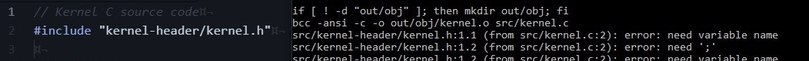
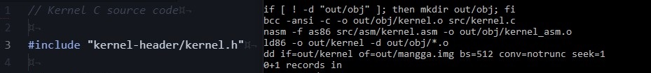

# Tugas Besar - IF2230 - Sistem Operasi
## Target dari rewriting
- Menggunakan `typedef` dan keyword lain yang disupport oleh `bcc -ansi`
  untuk mengusahakan readibiity yang tinggi.
- Melakukan redesign sistem untuk mencapai constraint pada milestone lebih
  cleaner.
- Penulisan step-by-step pengerjaan dan commit yang mewakili langkah-langkah pengerjaan.

 
 
 
 
 

## Catatan penting ketika melakukan pengerjaan
- Pastikan flag `-d` selalu ada ketika menjalankan perintah `ld86`. Flag tersebut membuat `ld86` menghapus header pada
output file dan menjadikan output sebagai [MSDOS COM executable](https://en.wikipedia.org/wiki/COM_file).
- Konsekuensi dari flag `-d` atas adalah **urutan definisi fungsi berpengaruh terhadap program**. Pastikan definisi fungsi
pertama kali merupakan `int main()`. Deklarasikan fungsi selain `main()` pada header atau bagian atas program jika ingin
memanggil pada main.
- Preprosesor `bcc` terkadang melakukan keanehan jika terdapat komentar dan `#include` bersebelahan baris. Jika mengalami
permasalahan tersebut, tambahkan **newline** diantara komentar dan `#include`.

Kegagalan compile `bcc`

 
 

Compile `bcc` berhasil

 
 
 
 
 

## Pengerjaan Milestone
Milestone   | Link readme markdown
---------   | --------------------
Milestone 1 | [Pengerjaan-Milestone-1](Pengerjaan-Milestone-1.md)
Milestone 2 | [Pengerjaan-Milestone-2](Pengerjaan-Milestone-2.md)
Milestone 3 | [Pengerjaan-Milestone-3](Pengerjaan-Milestone-3.md)
Appendix    | [Appendix](Appendix.md)

 
 
 
 
 

## Alat tambahan yang digunakan
Ketika membuat tahap pengerjaan, digunakan beberapa alat tambahan yang digunakan untuk membantu menjelaskan dan
 visualisasi. Berikut beberapa alat-alat yang digunakan

| Alat                                            |
| ----                                            |
| [manim](https://github.com/3b1b/manim)          |
| [texlive-minimal](https://www.tug.org/texlive/) |

**TBA**

<!-- ALSA - Vcxsrv -
internal readme
- Bochs troubleshoot,
chmod +x troubleshoot
Dependencies
ALSA - Vcxsrv - Ubuntu 20.04 - <TBA>
- xserver
https://medium.com/javarevisited/using-wsl-2-with-x-server-linux-on-windows-a372263533c3
https://www.stat.ipb.ac.id/agusms/index.php/2019/01/15/how-to-run-graphical-linux-applications-on-bash-on-ubuntu-on-windows-10/
- ALSA
https://bbs.archlinux.org/viewtopic.php?id=94696
objdump -D -b binary -m i8086 <filename>

https://www.fountainware.com/EXPL/bios_key_codes.htm
-->
