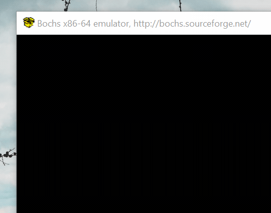
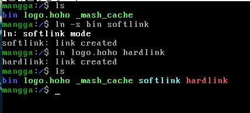
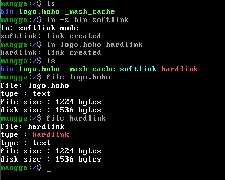
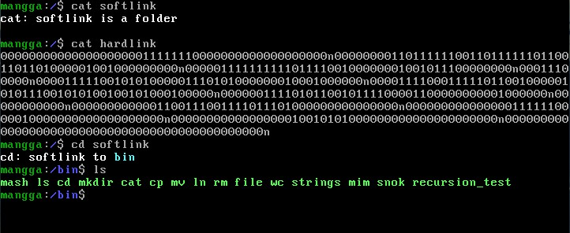
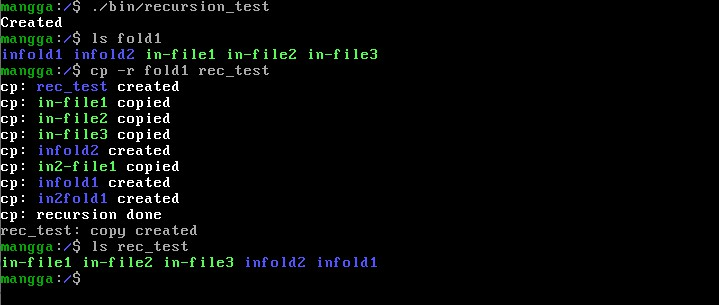
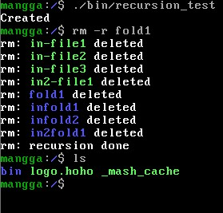
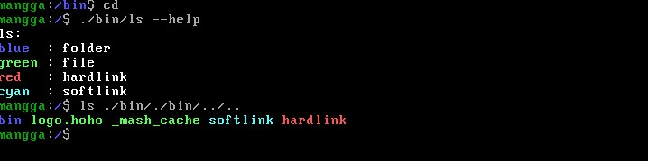
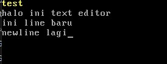
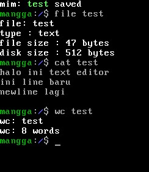
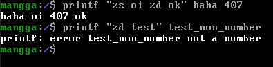

# Tugas Besar - IF2230 - Sistem Operasi
Future edit:
- Repository ini merupakan hasil pengerjaan tugas penulis [sistem-operasi-mangga@informatika19](https://github.com/informatika19/sistem-operasi-mangga) pada tahun 2021
- Repo ini adalah inspirasi utama 16-bit toy OS, [OS-2022@Sister19](https://github.com/Sister19/OS-2022) (asisten OS round 1)
- Dan menjadi dasar untuk 32-bit toy OS, [OS-2023@Sister20](https://github.com/Lock1/OS-2023) (asisten OS round 2)
- And again, 32-bit toy OS dengan context switching [OS-2024@labsister21](https://github.com/Lock1/OS-2024) (asisten OS round 3)

**Kelompok Mangga K04**

Repository ini akan digunakan sebagai duplikat dari repository yang terdapat pada GitHub Classroom informatika19 (https://github.com/informatika19/sistem-operasi-mangga)

Catatan : Branch `main` untuk sementara dijadikan repository untuk pengerjaan asli milestone sistem operasi, untuk pengerjaan ulang dan penulisan step-by-step pengerjaan berada pada branch [rewrite](https://github.com/Lock1/OS-IF2230/tree/rewrite) dan branch-branch milestone.

Log : 3 April 2021, Upload v2.0.0 \
Log : 23 April 2021, Penambahan README.md milestone 3 \
Log : 27 April 2021, Penambahan milestone 3 dan branch baru \
Log : 28 April 2021, Pengerjaan ulang milestone 1, cek pada [milestone-1](https://github.com/Lock1/OS-IF2230/tree/milestone-1)

## Anggota:
Nama                    | NIM
----------------------- | --------
Gregorius Dimas Baskara | 13519190
Christian Gunawan       | 13519199
Tanur Rizaldi Rahardjo  | 13519214

## Instruksi menjalankan
1. `chmod +x build-run.sh get-tools.sh run.sh`
2. Jika menjalankan untuk pertama kali, pastikan semua tools ada atau jalankan `./get-tools.sh`
3. Jika fscreate belum ada di folder other, jalankan `make filesystemcreator`
4. Jalankan command `./build-run.sh` jika ingin menjalankan OS secara penuh & termasuk bonus dan akan menjalankan Bochs
5. Jika hanya ingin menjalankan gunakan `./run.sh`

## Package makefile
Jika tidak menginginkan menjalankan secara penuh menggunakan `./build-run.sh` dapat mencompile
program secara sebagian saja dengan command `make`, berikut recipe yang tersedia

Recipe       | Target
------------ | -----
all          | Membuat seluruh package
basekernel   | Membuat kernel saja tanpa shell
shellpackage | Insersi spesifikasi wajib shell
extrapackage | Insersi bonus utility program, cek isi [disini](#bonus-milestone-iii)

## Program loadFile
Untuk program loadFile, gunakan `make fileloader` untuk membuat program, program akan terletak pada
folder other dengan nama **loadFile**.

Program dapat dijalankan dengan `./loadFile <target image> <file>` untuk memasukan file kedalam image.
Contoh dari command tersebut adalah `./loadFile mangga.img inputfile1`.

## Note
Catatan, kode program dibuat hanya dengan keyword `while` untuk loop dan semua deklarasi terletak pada awal fungsi.
Hal ini disebabkan karena seringnya permasalahan pada `bcc` ketika menggunakan keyword-keyword C dan cara penulisan yang umum.
Sehingga menyebabkan kode cenderung *unreadable* untuk fungsi yang panjang.

Milestone I dan II juga menggunakan beberapa fungsi pendukung yang terdapat di beberapa file selain kernel.c seperti:
1. opr.c
2. output.c
3. screen.c
4. shell.c
5. std.c

dan beberapa header yang juga menjadi header atas .c tersebut.

## Spesifikasi Wajib
### Milestone I
#### 3.1. Persiapan disk image
Pada tahap ini digunakan utility `dd` untuk membentuk image yang bernama `mangga.img`.

#### 3.2. Bootloader
Bootloader dibuat dengan mengikuti kit yang telah disediakan dan dicompile menggunakan `nasm`.

#### 3.3. Pembuatan kernel
Kernel dibuat menggunakan kit yang disediakan dan mengikuti spesifikasi yang diminta.
Fungsi-fungsi yang terdapat pada spesifikasi diimplementasi tanpa penambahan fitur.
Pada tahap ini juga dibuat `bash` script dan makefile yang dapat digunakan untuk membentuk
kernel secara otomatis

#### 3.4. Menjalankan sistem operasi
Konfigurasi `if2230.config` dirubah pada penamaan disk imagenya dikarenakan perubahan nama
yang dilakukan pada tahap [pembuatan disk image](#31-persiapan-disk-image) sebelumnya.

#### 3.5. Implementasi interrupt 0x21
Untuk implementasi `printString` dan `readString` digunakan interrupt yang sesuai keperluannya.
Bagian untuk operasi string sederhana ditulis pada `std` dan bagian penulisan kelayar ditulis pada
`screen`. Implementasi `handleInterrupt21` mengikuti spesifikasi yang diberikan dan menambahkan beberapa
servis tambahan yang dapat digunakan library nantinya. Pada tahap ini juga diimplentasikan operasi sederhana
mod yang dapat digunakan sistem operasi.

### Milestone II
#### 3.1. Pembuatan filesystem
Pada tahap ini dibuat `filesystemcreator` yang mempermudah otomatisasi build kernel sebelum melanjutkan ke
pembuatan filesystem pada kernel. `filesystemcreator` membentuk secara otomatis `map`, `files`, dan `sectors`
menuruti konfigurasi yang digunakan. Konfigurasi tersebut dapat diganti jika ingin membuat konvensi filesystem
yang berbeda.

#### 3.2. Pembuatan syscall readSector, writeSector, readFile dan writeFile
Implementasi syscall readSector dan writeSector mengikuti spesifikasi yang diberikan. Untuk system call readFile
dan writeFile, diimplementasikan mengikuti konvensi yang ditulis pada spesifikasi dengan tambahan.
readFile dan writeFile dapat membaca dan membentuk folder menggunakan macro `FOLDER` pada buffer.
readFile akan mengembalikan `FOLDER` pada buffer dan writeFile akan menuliskan folder yang memiliki nama `path`.

#### 3.3. Pembuatan program loadFile
Program loadFile didasarkan pada writeFile namun diubah karena dicompile menggunakan `gcc`. Sebagian besar kode
hanya modifikasi secara minimum dari writeFile.

#### 3.4. Membuat shell sederhana
Shell dibuat dengan mensimulasikan user space dan kernel space, sehingga seluruh library `std` yang digunakan
`shell` tidak menggunakan system call kernel secara langsung. Library `std` akan menggunakan servis interrupt 0x21 yang
sediakan oleh kernel.

Pada pembuatan shell dibuat `directoryEvaluator` dan `directoryStringBuilder` yang sangat berguna
ketika melakukan operasi-operasi dasar pada filesystem. `directoryEvaluator` mempermudah evaluasi relative pathing suatu
program dengan mengembalikan hasil `P`-byte kepada caller. `directoryStringBuilder` dapat digunakan sebagai pembentuk absolute
directory string yang digunakan pada shell untuk membentuk current working directory.

Shell memiliki fungsi input custom `shellInput` yang akan mengembalikan string input dan command history.
Untuk memenuhi bonus autocomplete dan history, ditambahkan kode assembly `getFullKey` yang digunakan untuk mengambil
keycode dan scancode keyboard. `shellInput` menggunakan scancode dan keycode untuk menentukan tombol yang ditekan user dan
melakukan operasi yang sesuai. Autocomplete dilakukan dengan tombol tab dan menggunakan `directoryEvaluator`.
Command history disimpan pada queue yang dapat diakses dengan arrow keys.

`directoryEvaluator` mempermudah proses autocomplete dan memperbolehkan semua utility yang disupport
untuk melakukan autocomplete baik folder atau file. Autocomplete tidak membedakan file dan folder dikarenakan
dianggap dapat mempermudah user ketika melakukan operasi relative pathing.

### Milestone III
#### 3.1. Membuat library sederhana
Pada milestone II telah diimplementasikan wrapper system call yang selalu digunakan ketika implementasi `shell`
sehingga tahap ini hanya memisakan modul pada `std`. Simulasi user space dan kernel space yang dilakukan pada
milestone II memperbolehkan melewati pengerjaan 3.1 dan 3.2, sehingga tahap ini dilakukan setelah tahap [eksekusi program](#33-mengeksekusi-program).
Modul file I/O dan folder I/O tergabung menjadi satu pada
`std_fileio` dikarenakan menggunakan syscall yang sama namun berbeda argument yang diberikan. Modul teks dan
matematika dasar dinamai `std_stringio` dan `std_opr`.

#### 3.2. Membuat aplikasi utilitas
Bagian ini dikerjakan setelah bagian [eksekusi program](#33-mengeksekusi-program) telah diimplementasikan.
Utilitas wajib berikut telah diimplementasikan pada OS
Utilitas  | Fungsi                    | Cara Kerja
----------|---------------------------|-------------------
mv        | Memindahkan file/folder   | mv [file/folder] [source destination]
cp        | Mengcopy file/folder      | cp [file/folder] [source destination]
mkdir     | Mmbuat directory          | mkdir [folder]
rm        | Menghapus file/folder     | rm [file/folder]
cat       | Mencetak isi file         | cat [file/folder]
ln        | Membuat symbolic link     | ln -s [file yang mau dilink] [file yang akan dilink]

Program utilitas tersebut diletakkan pada folder `/bin/` yang dapat dieksekusi shell dimana saja.

#### 3.3. Mengeksekusi program
OS menggunakan prosedur `launchProgram` dan `executeProgram` yang telah disediakan pada spesifikasi.
Umumnya program akan dieksekusi pada segment memori `0x2000` atau `0x3000` dan tidak ditambahkan fitur
kembali kepada pemanggil prosedur dikarenakan keterbatasan waktu dan kernel space yang ada.

Ketika implementasi digunakan secara ekstensif debugger milik bochs untuk mencari tahu letak kesalahan
kode yang dibuat. Utilitas `hexedit` juga digunakan untuk mengecek penulisan pembacaan `writeFile`
dan `readFile` dapat menulis secara binary.

#### 3.4. Batasan-batasan
Kernel size telah diturunkan dari milestone II yang memiliki ukuran sebesar 32 sektor.
Dilakukan juga pengaturan yang sama pada `filesystemcreator` untuk mempermudah proses pembuatan.
Setiap utility akan memanggil shell lagi ketika selesai menjalankan operasinya.
Program utilitas memiliki ukuran dibawah 8192 bytes agar dapat di`loadFile` kedalam OS.

## Spesifikasi Bonus
### Bonus milestone I
Bonus boot logo diimplementasikan menggunakan boot logo mode grafis.
Boot logo diproses secara sederhana menggunakan python package `pillow`
atau deprecated package `pil` yang menghasilkan logo dalam bentuk data sederhana.
Nantinya data tersebut akan dibaca oleh kernel dan digunakan sebagai acuan
cara menggambar. Script python yang digunakan terletak pada [other/conv.py](other/conv.py).

### Bonus milestone II
Semua bonus berhasil untuk diimplementasikan dalam milestone ini, meliputi:
1. Symbolic link (ln) dalam mode soft link dengan menggunakan flag `-s`
2. Autocomplete file yang tersedia untuk cd, ls, dan cat
3. Autocomplete folder saat melakukan cd
4. Shell memiliki history (4 command)

### Bonus milestone III
Berikut merupakan utility program yang ditambahkan pada package `extrapackage`
+ strings
+ wc
+ file
+ mim
+ recursion_test
+ snok
+ whereis
+ printf

Beberapa utility memiliki parameter yang dapat digunakan pengguna ketika
menggunakan OS, berikut adalah parameternya

Utility | Parameter | Deskripsi
------- | --------- | ---------
ls      | --help    | Menunjukan legend warna
ln      | -s        | Membuat softlink
rm      | -r        | Penghapusan rekursif
cp      | -r        | Pengcopyan rekursif

Berikut beberapa fitur ekstra yang ditambahkan pada milestone III
+ Color coded printing pada ls
+ Relative execute & autocomplete
+ Full relative pathing & autocomplete
+ Interaksi penuh softlink dengan utility (broken softlink check, cat to linked file, etc)
+ clear & echo shell command
+ Semua bonus milestone sebelumnya telah diport ulang
+ Semua bonus milestone 3

## Screenshots
Berikut merupakan screenshot terbaru sistem operasi

### Linking dan color coded ls

### Linking dan pengecekan dengan file

### Linking dan pengujian cd & cat

### Pengujian recursive cp

### Pengujian recursive rm

### Relative path execute

### Text editor sederhana

### Hasil file dari text editor

### Utilitas printf

## System Requirements
- Distro linux

## Reference
1. Silberschatz, Galvin, Gagne. "Operating System Concepts", Chapter 10.
2. Asisten Sistem Terdistribusi. "Milestone 2 - 2021".
3. stanislavs.org/helppc/int_13.html

<!-- ALSA - Vcxsrv -
internal readme
- Bochs troubleshoot,
chmod +x troubleshoot
Dependencies
ALSA - Vcxsrv - Ubuntu 20.04 - <TBA>
- xserver
https://medium.com/javarevisited/using-wsl-2-with-x-server-linux-on-windows-a372263533c3
https://www.stat.ipb.ac.id/agusms/index.php/2019/01/15/how-to-run-graphical-linux-applications-on-bash-on-ubuntu-on-windows-10/
- ALSA
https://bbs.archlinux.org/viewtopic.php?id=94696
objdump -D -b binary -m i8086 <filename>

https://www.fountainware.com/EXPL/bios_key_codes.htm
-->
