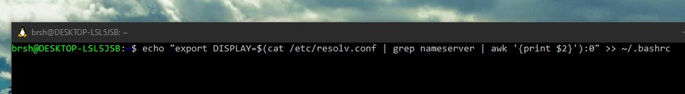

# Penggunaan Windows subsystem for linux untuk pengerjaan OS
## Instalasi WSL

[Windows subsystem for Linux](https://docs.microsoft.com/en-us/windows/wsl/about) atau disingkat sebagai WSL secara singkat
memperbolehkan pengguna Windows untuk menjalankan alat-alat sering digunakan pada distribusi Linux seperti `grep` dan
pipe redirection yang lebih powerful dibandingkan redirection milik `cmd` Windows.

Direkomendasikan untuk memasang WSL 2 dibandingkan WSL 1. WSL 2 dapat menjalankan 32-bit `ELF` executable dan sebagian besar
utility berfungsi secara normal pada WSL 2.

Instalasi WSL 2 dapat dicek pada link
[https://docs.microsoft.com/en-us/windows/wsl/install-win10](https://docs.microsoft.com/en-us/windows/wsl/install-win10).
Pastikan Windows 10 telah terupdate sebelum menjalankan instruksi pada link diatas. Untuk distribusi linux, direkomendasikan
memasang distribution **Ubuntu 20.04**.

## Memasang alat-alat pada WSL2
Instalasi alat-alat dapat mengikuti instruksi pada
.
Setelah memasang alat-alat untuk membuat sistem operasi,
lanjutkan ke instruksi berikut sebelum kembali ke pengerjaan milestone 1.

### Instalasi X server
1. Pasang [VcXsrv](https://sourceforge.net/projects/vcxsrv/) atau X server lainnya.
2. Carilah folder shortcut VcXsrv yang berada pada Start Menu seperti `C:\ProgramData\Microsoft\Windows\Start Menu\Programs\VcXsrv`.
3. Copy shortcut `XLaunch` dan berikan nama seperti `WSL-VcXsrv` atau yang lain.
4. 

Klik kanan dan pilih properties pada `WSL-VcXsrv`.

5. 

Masukkan parameter berikut pada kolom target, `"C:\Program Files\VcXsrv\vcxsrv.exe" :0 -ac -terminate -lesspointer -multiwindow -clipboard -wgl -dpi auto`. Pastikan program path sama dengan lokasi executable VcXsrv.

6. 

Jalankan WSL dan ketik kode berikut pada terminal `echo "export DISPLAY=$(cat /etc/resolv.conf | grep nameserver | awk '{print $2}'):0" >> ~/.bashrc`

7. Jalankan shortcut yang dibuat pada step 4 setiap kali ingin menjalankan `bochs`.
Jika ingin mengetes apakah instalasi berhasil pasanglah `xeyes` dengan package manager yang terdapat pada distribusi
(contoh pada ubuntu `sudo apt-get install xeyes`) dan jalankan command `xeyes` pada WSL.

 
